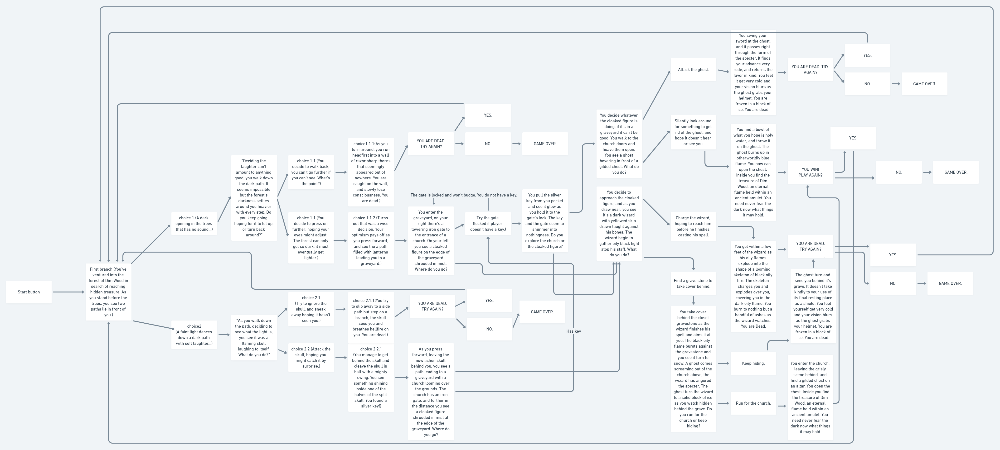
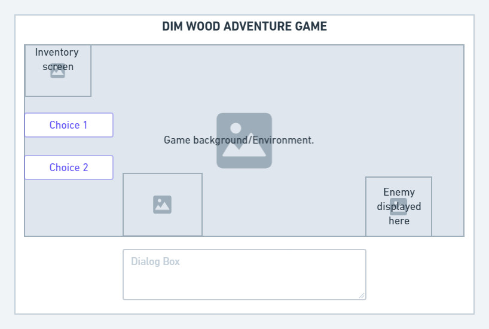

# Dim-Wood-Adventure
* A text adventure game made with javaScript, HTML, and CSS.

### Instructions for the game:
This game is played by choosing choice 1 or 2 as the story continues. If the player dies, you can either choose to try again, or end the game. You can also play again or end the game upon winning.

Launch the game: https://dimwoodadventure.netlify.app/

### Assets used:
* Royalty free music provided from whitebataudio: https://whitebataudio.itch.io/retro-horrorsci-fi-music-pack

* Backgrounds created from tile sets from: GothicVania

* Sprites animated from stills from: GothicVania

* Key icon from: https://stealthix.itch.io/rpg-icon-pack-16-x-16

* Moon icon from: www.flaticon.com

* Sun icon from: www.flaticon.com

* Bootstrap: https://getbootstrap.com/

* AnimateCSS: https://animate.style/

### Wireframes: 

### Future Enhancements: 
* Add smoother animations
* Add new GUI to look more coherent
* Change sprites to custom made
* Add sound effects upon actions
* Add win animations and more items
* Add more story branches
