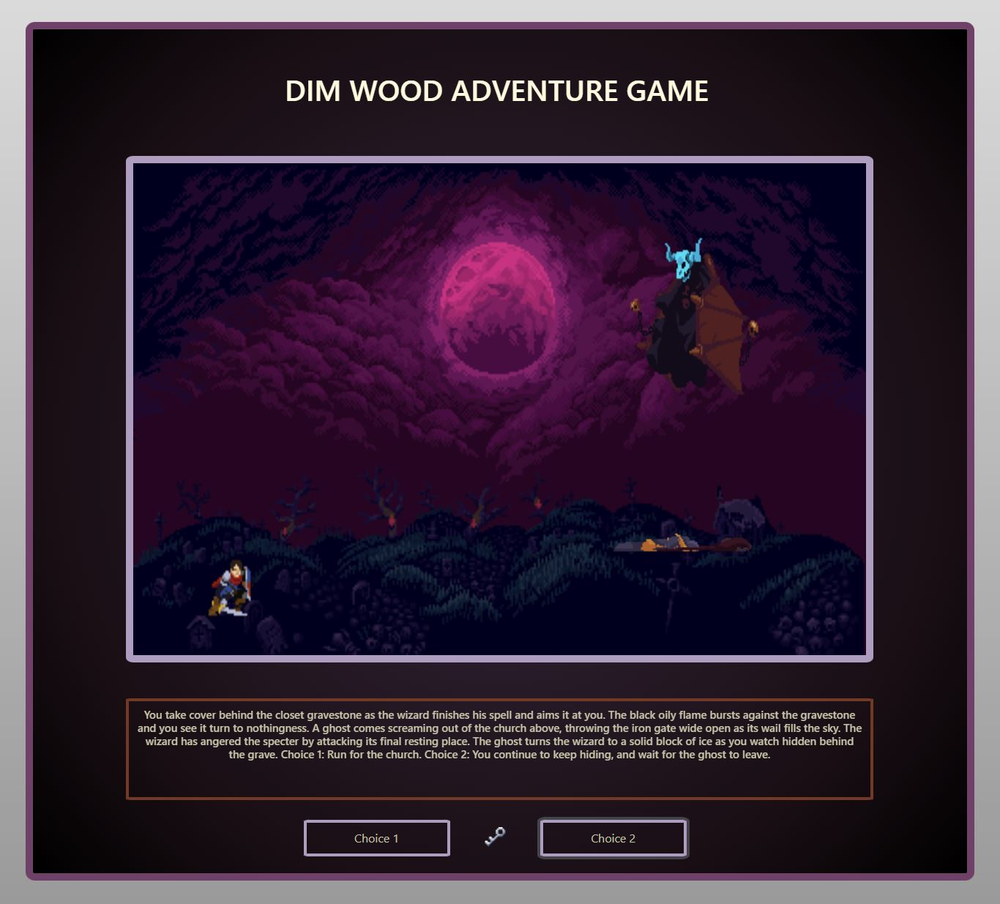
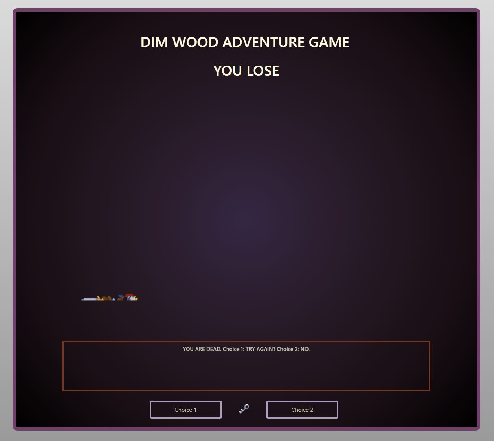

# Dim-Wood-Adventure
* A text adventure game made with javaScript, HTML, and CSS.

### Instructions for the game:
This game is played by choosing choice 1 or 2 as the story continues. If the player dies, you can either choose to try again, or end the game. You can also play again or end the game upon winning. If you end the game, you must refresh to start over.

### Launch the Deployed Game: [Here](https://dimwoodadventure.netlify.app/)

### Assets used:
* [Royalty free music](https://whitebataudio.itch.io/retro-horrorsci-fi-music-pack) provided from whitebataudio

* Backgrounds created from tile sets from GothicVania

* Sprites animated from stills from GothicVania

* [Key icon](https://stealthix.itch.io/rpg-icon-pack-16-x-16) 

* [Moon icon](www.flaticon.com) 

* [Sun icon](www.flaticon.com)

* [Bootstrap](https://getbootstrap.com/)

* [AnimateCSS](https://animate.style/)

### Wireframes: 

### Future Planned Enhancements: 
* Add smoother animations with preloading
* Add new GUI to look more coherent
* Change sprites to custom made
* Add sound effects upon actions
* Add win animations and more items
* Add more story branches
* Create mobile resposive version

### Thank you to
* My very patient instructors
* My talented classmates who I worked alongside with
* The absolute wizards who write MDN Documentation